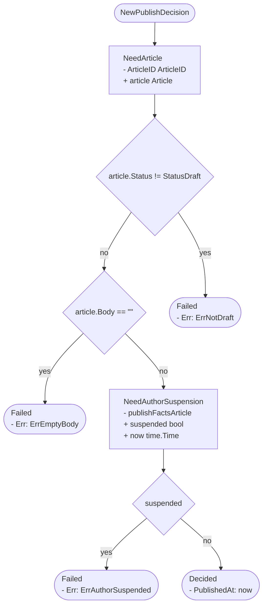
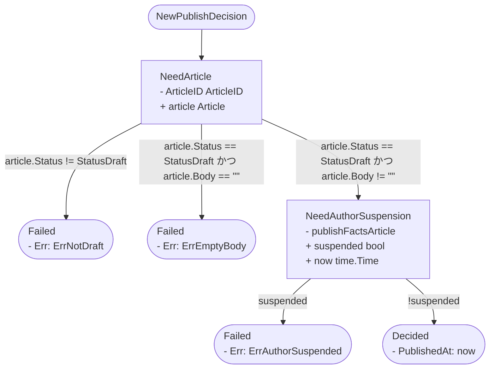

# flow

`//decision:decl` が付いた sum type の状態遷移を静的解析し、取りうる経路を Mermaid のフローチャートで出す。

```sh
go tool decision-pattern flow ./domain/...              # 標準出力
go tool decision-pattern flow -o docs/flow ./domain/... # Decision ごとに 1 ファイル
```

| フラグ | 意味 |
|---|---|
| `-o <dir>` | 出力先ディレクトリ。省略時は標準出力にまとめて書く |
| `-C <dir>` | 解析を実行する起点ディレクトリ |
| `-strict` | 警告が 1 件でもあれば終了コード 1 にする |
| `-shape <名前>` | 図の描き方。`decision`（既定）か `state`。[図の形](#図の形)を参照 |

## 何のためのものか

Decision パターンは判断と取得を分ける。その結果、実際にどの順でどのデータを取り、どの条件でどこへ分岐してどの結末に着くのかが、どちらを読んでも一度には見えない。

- domain 側: 状態ごとに `Decide` が分かれていて、全体の並びはどこにも書かれていない
- 呼び出し側: for-switch で次の状態を回すだけで、順序を持たない

状態遷移は型として書かれているので、そこから機械的に復元する。

## 例

記事の公開可否を判定する Decision（全文は [testdata/publish/publish.go](https://github.com/tomoemon/go-decision-pattern/blob/main/internal/flow/testdata/publish/publish.go)）。

```go
// publishFactsArticle は Article 取得で確定する事実。
type publishFactsArticle struct {
	ArticleID ArticleID
	AuthorID  AuthorID
}

// 開始状態。まだ何も確定していないので取得キーだけを持つ。
type PublishNeedArticle struct {
	ArticleID ArticleID
}

func (s PublishNeedArticle) Decide(article Article) PublishDecision {
	if article.Status != StatusDraft {
		return PublishFailed{Err: ErrNotDraft}
	}
	if article.Body == "" {
		return PublishFailed{Err: ErrEmptyBody}
	}
	return PublishNeedAuthorSuspension{
		publishFactsArticle: publishFactsArticle{ArticleID: article.ID, AuthorID: article.AuthorID},
	}
}

// 取得キーは確定済みの AuthorID。
type PublishNeedAuthorSuspension struct {
	publishFactsArticle
}

func (s PublishNeedAuthorSuspension) Decide(suspended bool, now time.Time) PublishDecision {
	if suspended {
		return PublishFailed{Err: ErrAuthorSuspended}
	}
	return PublishDecided{publishFactsArticle: s.publishFactsArticle, PublishedAt: now}
}
```

`decision-pattern flow` に通すと次が出る。



コードとの対応は次のとおり。

- `Xxx` プレフィックスは落とすので `PublishNeedArticle` は `NeedArticle` になる
- `- ArticleID ArticleID` は状態が持つ取得キー、`+ article Article` は `Decide` の引数
- `- publishFactsArticle` は埋め込んだ事実。中は展開しない
- 同じ `PublishFailed` でも `Err` が違えば別ノードになり、どの条件でどの結末に着くかが残る
- `PublishDecided` のリテラルは `publishFactsArticle` への代入を除いて `PublishedAt` だけ出る。事実はどの終端にも同じ形で運ばれるだけで、結末を分けないため

## 図の形

`-shape` で 2 通りの描き方を選ぶ。既定は `decision` で、前掲の図がそれにあたる。

ひし形が判断、四角と角丸が状態。`switch:` が付いたひし形は値による多分岐で、辺のラベルが case の値になる。付いていないものは真偽の判断で、辺は `yes` / `no` になる。タグの無い `switch`（`switch { case cond: }`）は `if` / `else if` と同義なので、真偽の判断として case ごとに分ける。

ヘルパー関数の中の判断には複数の経路から入ることがある。同じ AST ノードから来た判断は 1 つのノードにまとめるので、そこが合流として描かれる。

もう一方の `state` は状態だけをノードにする。

```
go tool decision-pattern flow -shape=state ./domain/...
```

判断はノードにならず、`return` に至るまでに通った条件が辺のラベルに「かつ」で連なる。ノード数が減るので、状態と状態の関係だけを俯瞰したいときに向く。前掲の例はこう出る。



分岐が深いほどラベルが伸び、同じ判断に複数の経路から入る形は経路ごとに複製されるので合流としては見えない。いずれも経路の条件を辺に畳む形式の性質で、実装では縮まない。

## 解析対象

`//decision:decl` が付いた interface だけを対象にする。

```go
//sumtype:decl
//decision:decl
type PublishDecision interface {
	isPublishDecision()
}
```

`//sumtype:decl` は go-check-sumtype 用の汎用マーカーで、Decision パターンと無関係な sum type にも付く。対象の判定に使うと、単なる結果の union まで図の対象になる。

タグが表すのは「この sum type は Decision パターンの状態機械である」という型の性質で、ツールの出力指示ではない。フローチャートの生成はそこから導かれる用途の 1 つ。

## 図に出るもの

| 要素 | 出どころ |
|---|---|
| 開始点 | interface を返す非メソッド関数 (`NewXxxDecision`) の `return` |
| 中間状態 (四角) | `Decide` を持つ状態 |
| 終端 (角丸) | `Decide` を持たない状態。返却リテラルのフィールドごとに分ける |
| 判断 (ひし形) | `Decide` の中の `if` / `switch`。同じものは 1 ノードにまとまる |
| 遷移のラベル | 選んだ枝の名前。`yes` / `no` か、`switch` なら case の値 |

`-shape=state` では判断がノードにならず、`return` に至るまでに通った条件を「かつ」で連ねたものが遷移のラベルになる。条件が無ければ「それ以外」。

ノードの中の箇条書きは記号で意味が変わる。同じ記号で並べると、持ち物と入力が同じものに見える。

| 記号 | 中身 |
|---|---|
| `-` | その状態が自分で持っているもの。Need なら取得キーと確定した事実、終端なら返却リテラルのフィールド |
| `+` | `Decide` に外から渡されるもの |

```
NeedArticle
- ArticleID ArticleID
+ article Article
+ now time.Time
```

終端を型ごとではなくリテラルごとに分けるのは、同じ `Decided` でも中身が違えば別の結末だから。まとめると「どの条件でどの結末になるか」が読めなくなる。

埋め込んだ事実の struct (`xxxFactsYyy`) は中を展開せず名前だけ出す。展開すると、事実を積み上げる Decision でノードが際限なく縦に伸びるうえ、同じ事実が全状態に繰り返し並ぶ。終端のリテラルでは、事実の struct への代入そのものを除く。どの終端にも同じ形で運ばれるだけで結末を分けない。

`return` が同じパッケージの関数呼び出しになっている場合は、その関数の中まで辿る。辿らないとヘルパーに切り出した分岐が図から丸ごと消える。

ノードは開始点からの幅優先順に並べ、ID もその順に振る。宣言は判断をまとめて先に、状態をまとめて後に書くので、ファイル上の並びは 1 本の幅優先順にはならない。箇条書きの先頭を揃えるため `classDef` で左寄せを指定する（`htmlLabels` が無効な環境では効かないが崩れはしない）。

## 警告

`-strict` を付けると失敗として扱う。

- どの経路からも到達しない状態がある。go-check-sumtype が見るのは呼び出し側の switch の網羅なので、「case は書いてあるが実際には到達しない状態」はここでしか分からない
- 図に 1 度も現れない状態がある。遷移メソッドを持たず誰からも返されない状態はノードにならないので、グラフの到達可能性では見つからない
- Decision に `nil` を返している。呼び出し側が状態を受け取れない
- `return` が静的に解決できない。別パッケージの関数越しなど
- 値では interface を満たさずポインタだけが満たしている状態がある。go-check-sumtype は通るが `case Xxx:` にマッチせず実行時に `default` へ落ちる

## 前提

規約に書かれていないことを 1 つだけ仮定している。

- 遷移メソッドの名前は `Decide`。規約では固定しているが、Go の型としては任意の名前を付けられる。別名にすると解析はその状態を終端とみなす。ただし黙って落ちることはなく、「図に現れない。<名前> が遷移メソッドに見える」と報告する

規約に書かれていることのうち、次に依存している。いずれも守られていなければ警告する。

- 状態は interface と同じパッケージにある
- 状態は値で返す
- 状態は非 nil

型検査を通すので、生成コードが揃っていない状態では失敗する。`go build ./...` が通る状態で実行すること。

## 制約

図が実態より粗くなる場合がある。いずれも誤りではないが、情報が落ちる。

- 終端をリテラルではなく変数で返していると、フィールドの内訳が出せず型名だけのノードになる。同じ変数を条件ごとに書き換えてから返す形では、経路ごとの違いが図に出ない
- ループの中の `return` は、ループであることを図に出さない。条件だけがラベルになる
- 別パッケージの関数越しに状態を返していると中を辿れない（警告する）
- 条件のソースをそのまま載せるので、条件が長いとひし形も大きくなる（`-shape=state` ではラベルが長くなり、分岐が多いコンストラクタでは開始ノードから伸びる線がその分増える）
- `case` の中で `break` するなど、構文を抜けた先へ複数の経路が合流する形は条件で表せない。経路は連言としてしか持てないので、合流した先の遷移には条件が付かない。`-shape=decision` ではその遷移がひし形を通らない裸の線になり、`-shape=state` では「それ以外」というラベルになる
